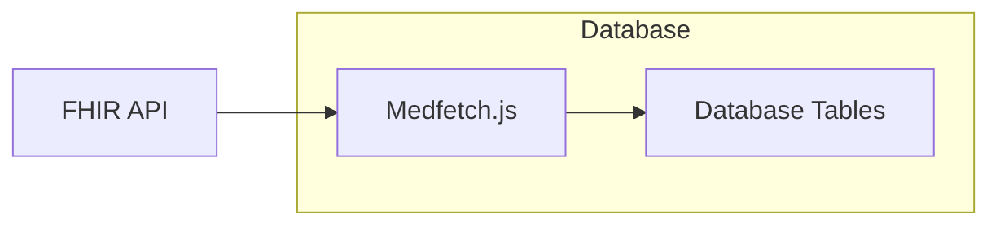
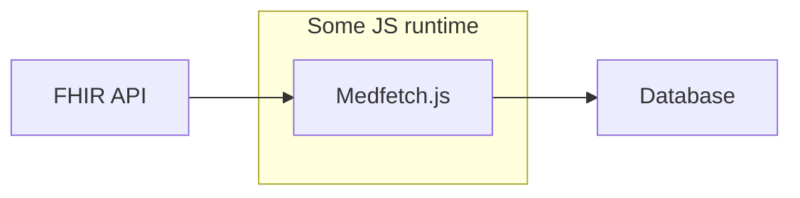

import { Cards, Callout } from "nextra/components";
import { SQLCodeblock } from "@/components/SQLCodeblock";
import { GoogleCallback } from "@/lib/google.oauth2";

<GoogleCallback />

# Introduction

Welcome to the medfetch.js docs!

## What is Medfetch.js?
Medfetch.js is a Javascript implementation of a FHIR to SQL pipeline inspired by the [SQL-on-FHIR](https://build.fhir.org/ig/FHIR/sql-on-fhir-v2/index.html) v2 specs. 
At a high level, Medfetch.js *fetches* FHIR JSON, *flattens* them, then *inserts* them into an SQL database.


The following table gives a summary on the databases and runtime Medfetch is currently supported on.

| Runtime           | Javascript| SQLite | Postgres |
|-------------------|-----------|--------|----------|
| Browser           | ✅        | ✅     | ❌       |
| Node.js / Native  | ✅        | ❌     | ❌       |

## In Database vs In Memory runners
Arguably speaking, Medfetch.js is *not* a faithful implementation of the specs, depending on
how you interpret the specs. For the purposes of an introduction the terms "in-database" and "in-memory" do a good enough job. 

### In-Database
Medfetch.js's in-database runners live inside your database as an extension, meaning
it doesn't touch the core logic of the database itself at all.


From your database, it pulls FHIR data directly and allows it to be queried as a table value. 
Optionally, it will use any user provided FHIRPath transformations and apply them to the 
JSON payload prior to inserting, if such a mapping is provided.

Here's an example of pulling some Patient data from the SmartHealth R4 Sandbox Server
on the Web Assembly build of SQLite. Hit run to see the query live.

<SQLCodeblock columns={["id", "gender", "first_name", "last_name", "birth_date", "city", "state"]}>
```sql
SELECT 
    id AS id,
    json -> 'gender' ->> 0 AS gender,
    json -> 'given' ->> 0 AS first_name,
    json -> 'family' ->> 0 AS last_name,
    json -> 'birthDate' ->> 0 AS birth_date,
    json -> 'city' ->> 0 AS city,
    json -> 'state' ->> 0 AS state
FROM medfetch('Patient', json_array(
    'gender',
    'name.given.first()',
    'name.family.first()',
    'birthDate',
    'address.city.last()',
    'address.state.last()'
));
```
</SQLCodeblock>

### In-Memory
Medfetch.js in-memory view runners are written in plain Javascript (TypeScript technically).
Currently, it is stable on modern web browsers and [Node.js](https://nodejs.org/en).



Performing the data pull + View Definition application from the above looks something like this.

```ts
import { medfetch } from "medfetch";

const sof = medfetch("https://r4.smarthealthit.org");
const flattened = await sof("Patient", [
    'id',
    'gender',
    'name.given.first()',
    'name.family.first()',
    'birthDate',
    'address.city.last()',
    'address.state.last()'
]);
```

How you insert the flattened data into a database is up to you.

### Choosing
Which type is best depends on your use case. The following table
should hopefully give you a better idea on which option you would want to use.

| Feature / Concern           | In-Database Runner                          | In-Memory Runner                              |
|----------------------------|---------------------------------------------|-----------------------------------------------|
| **Performance**            | ✅ Less I/O overhead. | ⚠️  *Usually* slower due to I/O overhead. |
| **Ease of Use**            | ✅ FHIR knowledge optional. | ❌ Requires familiarity of FHIR and SQL. |
| **Relational Semantics**   | ✅ Can perform JOINs | ⚠️ Can only manipulate one resource type at a time. |
| **Transformation Control** |⚠️ SQL for JSON data transformations. | ✅ Best control over transformations. |

Apart from JOINs* not being supported by the in-memory runner, the only other real
downside to the in-memory runner is the implicit requirement of FHIR knowledge, since the 
in-memory runner depends entirely on [View Definitions](https://build.fhir.org/ig/FHIR/sql-on-fhir-v2/StructureDefinition-ViewDefinition.html).

> *JOINs are explicitly left up to the database per the SQL on FHIR specs, which makes
a lot of sense considering the View Definition transformations are run indiscriminantly
against each resource in the input, so this isn't necessarily a downside, just a design limitation.

Performance is difficult to compare since V8 optimizes aggressively for JSON tree traversals / manipulations, meaning
FHIRpath transformations are actually faster in-memory than in-database. Even then, the I/O overhead of
*just* having to connect to the database separately to insert the database usually ends up rendering any speed gains
from V8 insignificant at best. This is especially true if you end up writing the flattened data
downstream to a traditional client/server database like [PostgreSQL](https://www.postgresql.org/).

For most real-world pipelines, the simpler option is often to run Medfetch.js directly inside the database. 
Since the library supports the full ViewDefinition transformation set in the database runners, what the memory runner 
provides in practice is more *control* over the transformation process.

At the end of the day, the best way to know which runner is right for you is to try it out yourself.

## Why SQL On FHIR?
JSONs are great. You can compact rich data into relatively small payloads
needing to worry about a fixed schema. Its flexible and expressive nature 
makes it a no-brainer pick for a data exchange format on the Web.

Combine it with a tree-traversal language like [FHIRPath]() and you have a
powerful way to express data transformations and extractions! Unfortunately, 
representing relations with JSONs tends to be difficult and complex, making it suboptimal 
for enforcing relational integrity between data points.

Tables are also great. Combine them with some relational algebra and you get SQL,
which *excels* at representing relational data. And if there's any type of data that is relational, 
clinical data might just be the poster child for that. However, its inherently strict schema designs
makes it a difficult format for data exchange, unlike JSONs.

Oversimplifying the 2 data formats:
> JSONs speak **across** systems. Tables think **within** them.

JSON has proven to be a strong web exchange module, and we don't expect them to go anywhere
anytime soon. At the same time, given how there are more [SQLite databases](https://sqlite.org/mostdeployed.html)
alone than [stars in the Milky Way](https://imagine.gsfc.nasa.gov/science/objects/milkyway1.html#:~:text=Our%20best%20estimates%20tell%20us,the%20suburbs%20of%20our%20galaxy.), we know SQL *definitely* isn't going anywhere.

Medfetch isn’t here to choose sides. It plays to their strengths, treating JSON as the data-in
and SQL tables as the data-out, giving you the best of both worlds.

## Next Steps
Dive into the [quick start](/quick-start) section to get started within in minutes.

Once you're up and running, feel free to check out the dedicated interface docs
for either the [in-memory](/javascript) or your specific [database](/sql) view runner. 
