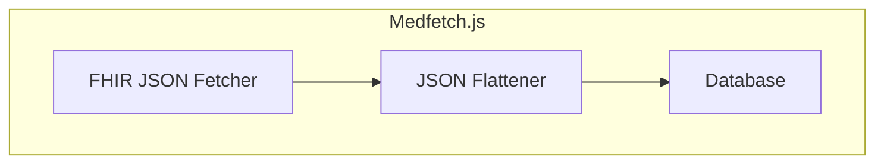
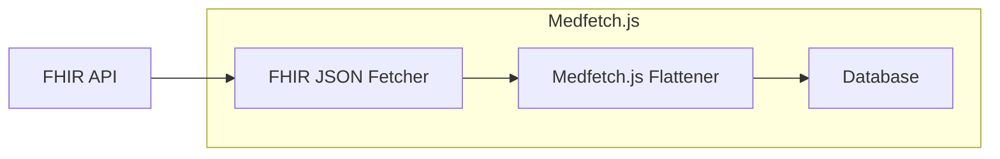
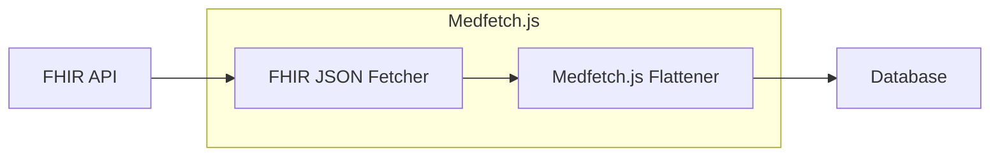

import { RunInDatabase } from "./RunInDatabase";
import { Cards, Callout } from "nextra/components";

# Introduction

Welcome to the medfetch.js docs!

## What is Medfetch.js?
Medfetch.js is a Javascript implementation of the [SQL-on-FHIR v2]() specs. At a high level,
this means it *fetches* FHIR JSON, *flattens* them, then *inserts* them into an SQL database of choice.



This library comes with a singular core "in-memory" View Runnner, along with multiple implementations
of "in-database" View Runners, depending on type of database you choose to run it on. The following table
gives a summary on the databases and runtime Medfetch is currently supported on.

| Platform | SQLite | Postgres | MySQL |
|----------|--------|----------|-------|
| Browser  | ✅     | ❌       | ❌    |
| Node.js  | ❌     | ❌       | ❌    |

> Medfetch.js is still in early development, but I plan on extracting the core logic to other SQL databases
and nodejs once the SQLite WebAssembly version is stable, so keep an eye out!

## In Database vs In Memory runners
The [SQL on FHIR]() specs outline two general variants of a View Runner, an 
In Database Runner and an In Memory Runner, both of which Medfetch.js provide.

### Database Runner
A Database runner runs directly on top of an SQL database to perform the row projections.


In order to do so, Medfetch.js hooks directly into your database of choice to provide an HTTP fetch
mechanism to it. After pulling, it inserts the data into a table, optionally using
any user provided FHIRPath transformations to run the projection prior to inserting, if 
such a mapping is provided.

In either case, once the data is written to the database, you can use your databases's native JSON capabilities
to further transform the data.

Here's an example of how Medfetch.js can be used from a Web Assembly build of SQLite.
Hit run to pull and transfer some Patient data from the [SmartHealth R4 Sandbox Server]()!

<RunInDatabase>
```sql
SELECT 
    json ->> 'id' AS id,
    json ->> 'gender' AS gender,
    json -> 'given' ->> 0 AS first_name,
    json -> 'family' ->> 0 AS last_name,
    json ->> 'birthDate' AS birth_date,
    json -> 'city' ->> 0 AS city,
    json -> 'state' ->> 0 AS state
FROM medfetch('Patient', json_array(
    'id',
    'gender',
    'name.given.first()',
    'name.family.first()',
    'birthDate',
    'address.city.last()',
    'address.state.last()'
))
LIMIT 5;
```
</ RunInDatabase>

### Memory Runner
An In Memory runner means your flattening process occurs on a process *separate* from your database.


Here's an example that performs the exact same query as above, but in JS alone.

```ts
import { medfetch, columnPath } from "medfetch";

const sof = medfetch("https://r4.smarthealthit.org/");
const MyPatients = await sof("Patient", [
    'id',
    'gender',
    'name.given.first()',
    'name.family.first()',
    'birthDate',
    'address.city.last()',
    'address.state.last()'
]);
```

Assuming this is done in nodejs, then inserting into the database might look something like:
```ts
import BetterSqlite3 from "better-sqlite3";

const db = new BetterSqlite3(":memory:");

// create the table
const columnNames = MyPatients.select[0].column.map(col => col.name);
const createTableSQL = `
  CREATE TABLE IF NOT EXISTS patients (
    ${columnNames.map(name => `${name} TEXT`).join(", ")}
  );
`;
db.exec(createTableSQL);

// Prepare insert statement
const placeholders = columnNames.map(() => "?").join(", ");
const insertSQL = `INSERT INTO patients (${columnNames.join(", ")}) VALUES (${placeholders})`;
const insert = db.prepare(insertSQL);

// Insert each row
const insertMany = db.transaction((rows) => {
  for (const row of rows) {
    insert.run(columnNames.map(col => row[col] ?? null));
  }
});

insertMany(MyPatients);

const MyPatientsFromDatabase = db.prepare("select * from patients;");
console.log(`Patient rows: ${JSON.stringify(MyPatientsFromDatabase, null, 2)}`);
```

### Choosing
Which type is best depends on your use case, The following table
should hopefully give you a better idea on which option you would want to use.

| Feature / Concern           | In-Database Runner                          | In-Memory Runner                              |
|----------------------------|---------------------------------------------|-----------------------------------------------|
| **Performance**            | ✅ Typically faster due to reduced I/O, as you write the JSON data directly within the database. | ⚠️ Usually slower  *overall* due to additional I/O... but you get V8’s aggressive optimizations for the tree/object manipulation itself. |
| **Ease of Setup**          | ❌ More involved setup (e.g. compiling SQLite with WASM + extension). | ✅ Simple to get started — just import and call from JS. |
| **Ease of Use**            | ✅ Pure SQL — No FHIRPath knowledge required. | ❌ Requires familiarity with [FHIRPath]() and [ViewDefinition](), **along** with familiarity of SQL. |
| **Transformation Control** |⚠️  SQL for data transformations + a limited [`sof`]() port on the database. | ✅ Best control over transformations since you're directly calling the projector [`sof`]() function. This beats the in-database runner solely because of this. |
| **Integration Complexity** | ✅ Offloads data fetching to database: you inherently get one less process to worry about (in terms of data fetching) | ⚠️ You are in charge of setting up both the data fetches and the insertion of that data into the Database |

It's worth noting that while I can't definitively say the in-memory runner is slower than the in-database one, my best guess is 
that any performance gain from V8's aggressive JSON traversal optimizations is likely outweighed by the I/O overhead involved in 
inserting that data into a separate database — especially when that database lives on a different machine (as is common with PostgreSQL or hosted solutions).

For most real-world pipelines, the simpler option is often to run Medfetch.js directly inside the database. Since the library supports the 
full ViewDefinition transformation set in SQL, what the in-memory runner provides in practice is more control over the transformation process <sup>1</sup>

<Callout type="info"> 
    <sup>1</sup> 
    Even if your pipeline involves heavy CPU-bound computations, that doesn't mean you need to use the in-memory runner. It’s often simpler (and faster) 
    to run Medfetch in-database, export the results, and hand off to Python (e.g. NumPy, pandas) for numeric processing (you could then write back to 
    the database, or write to a new one). V8 is fast at traversing JSON — you’ll absolutely benefit from that in the tree traversals.
    But if you're doing serious number crunching, the cost of using JS for computations will likely cancel that out. 
    Libraries like [NumPy]() are built for this kind of work, with raw CPU-level optimizations that JavaScript can’t match.
</Callout>

At the end of the day, the best way to know which runner is right for you is to try it out yourself.
Medfetch.js makes it easy for you to start flattening your FHIR data, since the primary API interface
across each Medfetch.js View Runner doesn't require any knowledge of FHIRPath and / or ViewDefinitions
to get started!

## Why SQL On FHIR?
JSONs are great. You can compact rich data into (relatively) small data payloads
without needing to worry about a fixed schema. So it makes sense to use something like JSONs as the 
primary data format for data transfer for [clinical data exchange](https://build.fhir.org/exchange-module.html).
Combine JSON payloads with a tree-based navigation language like [FHIRPath](https://build.fhir.org/fhirpath.html)
and you have an incredibly powerful way to extract and manipulate FHIR JSONs!

Tables are also great. Rows and columns have been battle tested for centuries after all,
even before computers were around. Combine them with some relational algebra and you get SQL, 
which *excels* at representing relational data. And if there's any type of data that is relational, 
clinical data might just be the poster child for that.

Oversimplifying the 2 data formats:
> JSONs speak **across** systems. Tables think **within** them.

JSON has proven to be a strong web exchange module, and we don't expect them to go anywhere
anytime soon. And given how there are more [SQLite databases](https://sqlite.org/mostdeployed.html)
alone than [stars in the Milky Way](https://imagine.gsfc.nasa.gov/science/objects/milkyway1.html#:~:text=Our%20best%20estimates%20tell%20us,the%20suburbs%20of%20our%20galaxy.), we know SQL *definitely* isn't going anywhere.

Medfetch isn’t here to choose sides. It treats JSON as the ideal data-in, and SQL as the ideal data-out — transforming FHIR payloads into queryable tables, 
without losing what makes either format powerful. 

## Next Steps
Dive into the [quick start](/quick-start) section to get started within in minutes,
or head over to the [installation]() page for a comprehensive setup overview. 

Once you're up and running, feel free to check out the [philosophy](/philosophy) and [core concepts](/core-concepts) pages.
You don't need them to use Medfetch, but if you're curious about the *why* behind the *what*, they'll be well worth your time.
