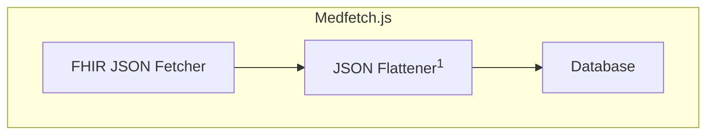
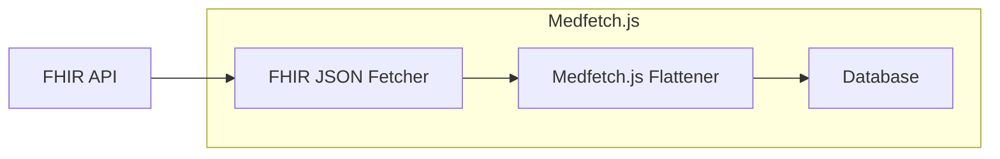
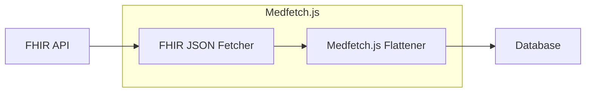

import { RunExampleWrapper } from "./RunExampleWrapper";
import { Cards, Callout } from "nextra/components";

# Introduction

Welcome to the medfetch.js docs!

## What is Medfetch.js?
Medfetch.js is a JavaScript-based toolchain library for implementing the [SQL-on-FHIR v2]() specs. This means
it facilitates the *input* of [FHIR JSON]() data into your process(es) of interest so they can *output* SQL like tables.


<Callout type="info">
    <sup>1</sup> Thanks to the JSON storage capabilities of modern SQL databases, Medfetch.js doesn't strictly *need* to
    output a scalar value for each column. You *could* dump entire [FHIR Resources]() or heavily nested child
    fields onto TEXT like columns with Medfetch.js, for example. In practice, however, the goal is
    to transform the JSON into scalar columns — or at the very least, to unnest and/or prune significant parts of the JSON tree.
</Callout>

## How does it work?
This library provides **you** the means to build and interact with this pipeline -- a so-called [View Runner](),
as found in the SQL on FHIR specifications. The term View Runner is the canonical label used in the spec, so
you'll see it referenced throughout the docs.

It's important to keep in mind that the View Runner is abstract. Where
this JSON 2 SQL pipeline fits into your system -- and how exactly it runs -- depends on 
architecture-specific factors and answers to questions such as:

1. ***Who*** is responsible for making the FHIR API requests for the JSONs?
2. ***Who*** is responsible for flattening / tabularizing that data?
3. ***How*** should said data be flattened / tabularized?
4. ***Where*** do these tables go ultimately?

This isn't an exhaustive list of architectural factors by any means, but it provides
a good overview of what factors should go into your pipeline design. 
Medfetch.js was built to support a wide range of these pipelines while staying practical — it’s not 
a single solution, but a toolchain for implementing a View Runner that fits your system.

## In Database vs In Memory runners
The [SQL on FHIR]() specs outline two general variants of a View Runner, an 
In Database Runner and an In Memory Runner. Medfetch.js provides you the tools
to implement both. No matter what type of runner you decide on, you will most likely
end up invoking the main JSON flattener function [`sof`](), whether that be indirectly
or directly. Here is a simplified overview of where Medfetch.js would be invoked from
based on which type of View Runner you decide on.

### Database Runner
A Database runner runs directly on top of an SQL database to perform the row projections.


Medfetch.js will hook into your database of choice<sup>2</sup> to provide an HTTP fetch
mechanism to it. After pulling, it inserts the data into a table, optionally using
any user provided FHIRPath transformations to run the projection prior to inserting, if 
such a mapping was provided.

In either case, you can now use your databases's native JSON capabilities to further transform the data.

Here's an example of how Medfetch.js can be used from a Web Assembly SQLite database
(this one will run on the actual [binary]()!).

<RunExampleWrapper>
```sql
SELECT 
    json ->> 'id' AS id,
    json ->> 'gender' AS gender,
    json -> 'given' ->> 0 AS first_name,
    json -> 'family' ->> 0 AS last_name,
    json ->> 'birthDate' AS birth_date,
    json -> 'city' ->> 0 AS city,
    json -> 'state' ->> 0 AS state
FROM medfetch('Patient', json_array(
    'id',
    'gender',
    'name.given.first()',
    'name.family.first()',
    'birthDate',
    'address.city.last()'
))
LIMIT 5;
```
</RunExampleWrapper>


### Memory Runner
An In Memory runner means your flattening process occurs on a process *separate* from your database.


This involves less abstractions, since the transformations are done completely in JavaScript.
Here's an example that performs the exact same query as above, but on a JS script:

```ts
import { sof, pagen } from "medfetch";

const response = await pagen()
```

Which type is best depends, again, on your use case (I'm sorry!), the following table
should hopefully give you a better idea.

| Feature / Concern           | In-Database Runner                          | In-Memory Runner                              |
|----------------------------|---------------------------------------------|-----------------------------------------------|
| **Performance**            | ✅ Typically faster due to reduced I/O overhead, as you write the JSON data directly within the database | ⚠️ Usually slower due to I/O penalty from having to write from the application to the database — but has the edge of V8’s JSON performance. |
| **Ease of Setup**          | ❌ More involved setup (e.g. compiling SQLite with WASM + extension) | ✅ Simple to get started — just import and call from JS |
| **Ease of Use**            | ✅ Pure SQL — you don’t need to know FHIRPath or View Definitions | ❌ Requires familiarity with [FHIRPath]() and [ViewDefinition]() |
| **Transformation Control** |⚠️  SQL for data transformations + a limited [sof]() port on the database. | ✅ Best control over transformations since you're directly calling the projector [sof]() function. This beats the in-database runner solely because of this: Any numerically intensive transformations would probably be better off done outside of JavaScript anyway. |
| **Integration Complexity** | ✅ Removes / offloads the data fetching routine from another process, connecting the database directly with the FHIR API | ⚠️ You are in charge of setting up both the data fetches and the insertion of that data into the Database |

More often than not, the In Database Runner is likely the better option since you would most likely be integrating your View Runner into a larger
ETL-like pipeline, implying the Database on which you run Medfetch.js on is *not* the data's final destination. Even if you do decide you need to

## Why SQL On FHIR?
JSONs are great. You can compact rich data into (relatively) small data payloads
without needing to worry about a fixed schema. So it makes sense to use something like JSONs as the 
primary data format for data transfer for [clinical data exchange](https://build.fhir.org/exchange-module.html).
Combine JSON payloads with a tree-based navigation language like [FHIRPath](https://build.fhir.org/fhirpath.html)
and you have an incredibly powerful way to extract and manipulate FHIR JSONs!

Tables are also great. Rows and columns have been battle tested for centuries after all,
even before computers were around. Combine them with some relational algebra and you get SQL, 
which *excels* at representing relational data. And if there's any type of data that is relational, 
clinical data might just be the poster child for that.

Oversimplifying the 2 data formats:
> JSONs speak **across** systems. Tables think **within** them.

JSON has proven to be a strong web exchange module, and we don't expect them to go anywhere
anytime soon. And given how there are more [SQLite databases](https://sqlite.org/mostdeployed.html)
alone than [stars in the Milky Way](https://imagine.gsfc.nasa.gov/science/objects/milkyway1.html#:~:text=Our%20best%20estimates%20tell%20us,the%20suburbs%20of%20our%20galaxy.), we know SQL *definitely* isn't going anywhere.

Medfetch isn’t here to choose sides. It treats JSON as the ideal data-in, and SQL as the ideal data-out — transforming FHIR payloads into queryable tables, 
without losing what makes either format powerful. 

## Next Steps
Dive into the [quick start](/quick-start) section to get started within in minutes,
or head over to the [installation]() page for a comprehensive setup overview. 

Once you're up and running, feel free to check out the [philosophy](/philosophy) and [core concepts](/core-concepts) pages.
You don't need them to use Medfetch, but if you're curious about the *why* behind the *what*, they'll be well worth your time.
